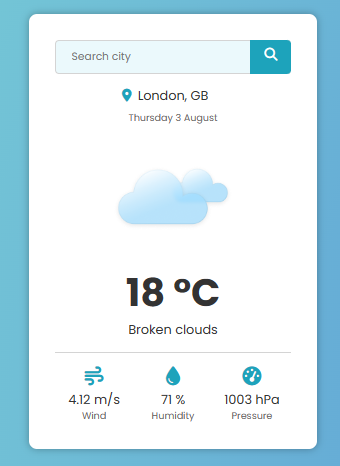

# Weather app

Weather app built with React and Typescript. Includes integration with OpenWeatherAPI.

# Stack

React, Typescript, OpenWeather API

# API

Weather data is retrieved from http://openweathermap.org/

# Live demo

You can load live demo project by clicking this link https://maringr.github.io/weather-ts/

